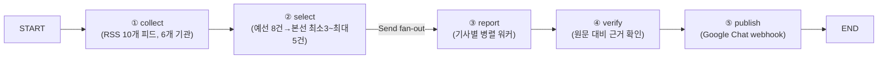

# 대입·교육정책 뉴스레터 에이전트

입학사정관·진학상담교사를 위해 매일 아침 대입·교육정책 소식을 수집·선별·요약·검수해 Google Chat으로 발행하는 LangGraph 에이전트입니다.

Aiffel "6. 에이전트 팀 꾸리기" 실습 프로젝트로, AI 뉴스 도메인의 예시 코드를 대입·교육정책 도메인으로 옮긴 것입니다. 설계 배경과 의사결정 과정은 [REPORT.md](REPORT.md)에 정리돼 있습니다.

## 파이프라인



1. **수집**: 베리타스알파(대입·대학·고입·고교·교육 5개 섹션), 에듀동아, 에듀진, 한국대학신문, KEDI 보도자료, 서울특별시교육청 — 총 10개 RSS 피드
2. **선별**: `audience.yaml`에 정의한 7개 중요도 기준으로 예선(묶음당 8건)→본선(최소 3~최대 5건)을 GPT-4.1-mini가 고름. 본선 결과가 3건 미만이면 예선 통과작으로 코드가 자동 보충
3. **요약**: 선별된 기사 본문을 읽고 헤드라인·요약·인사이트("왜 중요한지")·토픽(6개 분류)을 작성
4. **검수**: 요약이 원문에 근거하는지 GPT가 재판정, 근거 없으면 발행 목록에서 제외
5. **발행**: Google Chat 웹훅으로 전송 (토픽별 이모지 표시), `DRY_RUN=1`이면 콘솔 미리보기만 출력

## 파일 구조

```
graph.py                # LangGraph 파이프라인 (5개 노드)
config.py                # audience.yaml 로딩 및 프롬프트 조립
audience.yaml             # 독자·중요도 기준·버릴 것·토픽 설정 (분야별로 이 파일만 갈아 끼우면 됨)
run.py                    # 실행 스크립트
metrics_report.py         # 소스별 발행 기여 성적표
store/metrics.jsonl       # 실행마다 한 줄씩 쌓이는 지표 기록
requirements.txt
tests/                    # pytest 유닛 테스트 (설정 로딩, 발행 텍스트 조립, 날짜 처리, 최소건수 보충)
.github/workflows/daily.yml   # 매일 KST 07:30 자동 실행 + 지표 커밋
REPORT.md                 # 소스 채택표·선별 로직·회고 등 프로젝트 보고서
```

## 실행하기

### 1. 설치

```bash
pip install -r requirements.txt
```

### 2. 환경변수 (`.env`)

```
OPENAI_API_KEY=sk-...
GCHAT_WEBHOOK_URL=https://chat.googleapis.com/v1/spaces/...
```

`GCHAT_WEBHOOK_URL`이 없거나 `DRY_RUN=1`이면 실제로 전송하지 않고 콘솔에 미리보기만 출력합니다.

### 3. 실행

```bash
python run.py --dry-run   # 미리보기만, 실제 발행 안 함
python run.py             # 실제 발행
```

### 4. 테스트

```bash
pytest
```

### 5. 지표 확인

```bash
python metrics_report.py
```

## 내 분야로 바꾸기

`audience.yaml`의 독자·중요도 기준·버릴 것·토픽만 고치고, `graph.py`의 `SOURCES`를 원하는 RSS 피드로 바꾸면 코드는 그대로 재사용할 수 있습니다. 설계 원칙과 각 선택의 이유는 [REPORT.md](REPORT.md)를 참고하세요.
