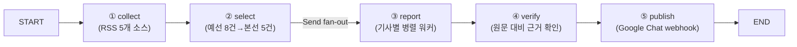

# REPORT — 대입·교육정책 뉴스레터 에이전트

## 1. 분야 및 독자 정의

- 분야: 대입·교육정책 (교육정책·대학정보·대입·고교정보)
- 독자: 입학사정관·진학상담교사 — 대학 입학처에서 전형을 설계·심사하는 사람, 고교에서 학생 진학을 지도하는 사람
- 배경: 입시 제도·대학 모집요강이 자주 바뀌는데, 상담·심사 현장에서 매일 아침 핵심 변화만 짚어주는 브리핑이 필요하다고 판단했다.

## 2. 소스 채택표

| 소스 | URL | 상태 | 채택 여부 | 근거 |
|---|---|---|---|---|
| 베리타스알파 · 전체기사 | `https://www.veritas-a.com/rss/allArticle.xml` | HTTP 200 | 채택 | 표준 RSS 2.0. 대입 섹션 전용(`S1N2.xml`)도 검토했으나, 대입 외 전체 뉴스도 놓치지 않도록 전체기사 피드로 최종 결정. 업무협약 등 무관 기사가 섞여 들어오지만 ②선별의 "버릴 것" 기준으로 정상적으로 걸러짐을 실행으로 확인 |
| 에듀동아 | `https://edu.donga.com/rss/allArticle.xml` | HTTP 200 | 채택 | 표준 RSS 2.0 |
| 한국대학신문(UNN) | `https://news.unn.net/rss/allArticle.xml` | HTTP 200 | 채택 | 표준 RSS 2.0, 대학 소식 전문지 |
| 한국교육개발원(KEDI) 보도자료 | `https://www.kedi.re.kr/khome/main/announce/rssAnnounceData.do?board_sq_no=3` | HTTP 200 | 채택 | 교육부 산하 국책연구기관의 정책·통계 발표. 공식 발표에 가장 근접한 실사용 가능 소스 |
| 서울특별시교육청 | `https://enews.sen.go.kr/rss.do` | HTTP 200 | 채택 | 16개 시도교육청 중 유일하게 확인된 공식 RSS(전체기사, 42,626건 누적). 날짜만 있고 시각이 없는 `pubDate` 형식이라 수집 로직에 KST 보정을 추가함(§3 참고) |
| 나머지 15개 시도교육청(부산·대구·인천·대전·울산·세종·경기·강원·충북·충남·전북·경북·경남·전남·광주·제주) | 각 공식 사이트 | RSS 없음 | 탈락 | 서브도메인 패턴 추측 시도 전부 연결 실패. 유사 오픈소스 프로젝트(`j-k-park/edu-news`)도 이 15곳은 전부 공식 RSS를 못 찾아 구글 뉴스 검색으로 대체하고 있음을 교차 확인 |
| 교육부 보도자료 | `moe.go.kr/boardCnts/list.do?boardID=294...` | RSS 없음 | 탈락 | 목록이 JS로 렌더링되어 `requests`로 수집 불가 |
| 한국대학교육협의회(대교협) | 공식 사이트 | RSS 없음 | 탈락 | RSS 링크 미발견 |
| korea.kr 정책브리핑 | `korea.kr/rss/dept_A00002.xml` 등 | 404 | 탈락 | 부처별 RSS가 체크박스 커스텀 생성 방식으로 추정, 정적 URL 확인 실패 |
| KICE 학생평가지원포털 | `stas.moe.go.kr` | RSS 안내 링크는 있으나 SPA | 탈락(보류) | 실제 피드가 JS 렌더링, API 엔드포인트 미확인 — 스트레치 목표 |
| KEDI 공지사항 | `board_sq_no=1` | HTTP 200 | 탈락 | 타 국책연구기관(에너지경제연구원 등) 채용공고 등과 섞여 관련성 낮음 |
| KEDI 교육정책포럼 저널 | `rssMZJournalData.do` | Exception page | 탈락 | URL 접근 불가 |
| KOSIS 최근수록자료 | `kosis.kr/rss/themes_rss.jsp` | HTTP 200 | 탈락 | 전국 전분야 통계가 섞여 노이즈가 큼 (교육 카테고리 미필터) |
| 커리어넷 드림레터 | `career.go.kr/.../dreamLetter.rss` | HTTP 500 | 탈락 | URL이 깨져 있음 |

최종 채택: 5개 소스 (베리타스알파, 에듀동아, 한국대학신문, KEDI 보도자료, 서울특별시교육청).

## 3. 선별 로직 설계

- 중요도 판단 문장(5개, `audience.yaml`의 `중요도_기준`):
  1. 신학년도 입시 일정·제도가 새로 발표되었는가 (수시·정시 일정, 전형 신설·폐지)
  2. 특정 대학의 신학년도 모집요강이 새로 발표되었는가 (정원, 신설 학과·전형)
  3. 교육부·KICE가 정책을 발표했는가 (고교학점제, 수능 개편 등)
  4. 입시 지원·합격 관련 통계가 갱신되었는가 (지원율, 경쟁률, 충원율, 합격선 등 대입 결과 지표. 대출·취업 등 입시와 무관한 일반 통계는 제외)
  5. 특정 대학의 정원·구조·재정지원 관련 소식이 발표되었는가 (통폐합, 정원 조정, 재정지원사업 선정, 취업률 등 운영 지표 공개)
- 4번 기준은 원래 "통계·데이터"로 더 넓게 썼다가, 실제 `--dry-run` 검증 중 "40대 학자금대출 연체" 같은 입시와 무관한 통계 기사가 선별되는 걸 발견해서 "입시 지원·합격 관련"으로 좁혔다. 5번은 애초 토픽 분류에는 "대학 소식"(취업률·정원·구조)이 있었는데 선별 기준에는 대응 항목이 없어서, 그런 기사가 애초에 ②선별을 통과하지 못하는 문제를 발견하고 추가했다.
- 1·2·5번은 처음에 "바뀌었는가"로 썼다가 "발표되었는가"로 다시 고쳤다. 입시 일정·모집요강·재정지원사업 선정은 매년 정기적으로 새로 나오는 정보라서, "작년과 달라졌는가"를 묻는 "바뀌었는가"는 정기 발표 자체를 놓칠 위험이 있었다. 반면 3번(정책 발표)이나 통폐합처럼 비정기적 이벤트는 애초에 "발표/변화"라는 사건 자체가 기준이 되는 게 맞다.
- 예선/본선 2단계 구조: 예선은 `BATCH=40`건씩 묶어 각 묶음에서 8건씩 추리고, 본선에서 예선 통과작 전체를 한 화면에 놓고 최종 `TARGET`(기본 5)건을 고른다. 묶음 크기 40은 GPT-4.1-mini 한 번의 컨텍스트에 제목 목록을 다 올려도 판단 정확도가 떨어지지 않는 선에서 정한 값이다 (기존 AI 뉴스 버전에서 검증된 값을 그대로 재사용).
- 같은 사건을 다룬 중복 기사는 `event` 라벨로 묶어 하나만 남긴다.
- 실행마다 수집 건수·선별 건수가 달라질 수 있다는 것도 실제 반복 실행으로 확인했다: (a) 시간이 지나며 RSS 원본 콘텐츠 자체가 바뀌고, (b) `select()`가 LLM(GPT-4.1-mini, `temperature=0`)을 호출하는데 이것도 완전히 결정적이지는 않다. 같은 4건을 수집해도 선별 결과가 2건 나온 실행과 3건 나온 실행이 있었다.

## 4. 파이프라인 구조도

State(`Brief`): `hours, collected, dead, picked, drafted, verified, log`

## 5. 실행 기록

<!-- 아래를 채우는 방법:
1. .env에 실제 OPENAI_API_KEY, GCHAT_WEBHOOK_URL을 넣는다 (완료됨 — GCHAT_WEBHOOK_URL 등록 확인함)
2. DRY_RUN 없이 실행: `python run.py`  (DRY_RUN 환경변수를 0으로 주거나 run.py 인자에서 --dry-run을 뺀다)
3. Google Chat 스페이스에 실제로 메시지가 도착한 화면을 캡처해 이 섹션에 이미지로 첨부한다
4. `python metrics_report.py` 출력도 함께 캡처해 첨부한다
-->

(실행 후 캡처 이미지 삽입 예정 — dry-run 검증은 완료했고, 실제 발행은 아직 하지 않음)

## 6. 프로젝트 회고

<!-- 아래 두 질문에 실제 경험을 바탕으로 답한다:
- 가장 공들인 부분: 예) 소스 채택 과정에서 교육부/KICE 공식 RSS가 없다는 것을 직접 확인하고 대안(KEDI)을 찾은 과정, 선별 기준을 실제 실행 결과를 보고 두 차례 조정한 과정
- 향후 보완하고 싶은 점: 예) KICE 학생평가지원포털의 실제 API 엔드포인트를 브라우저로 추적해 공식 발표 소스를 추가하는 것
-->

(실행 후 회고 작성 예정)
