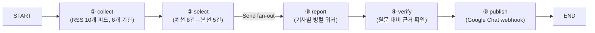
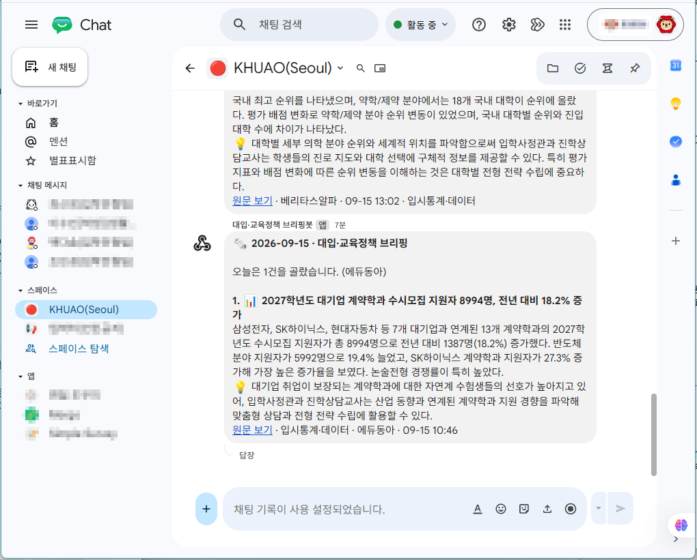

# REPORT — 대입·교육정책 뉴스레터 에이전트

## 1. 분야 및 독자 정의

- 분야: 대입·교육정책 (교육정책·대학정보·대입·고교정보)
- 독자: 입학사정관·진학상담교사 — 대학 입학처에서 전형을 설계·심사하는 사람, 고교에서 학생 진학을 지도하는 사람
- 배경: 입시 제도·대학 모집요강이 자주 바뀌는데, 상담·심사 현장에서 매일 아침 핵심 변화만 짚어주는 브리핑이 필요하다고 판단했다.

## 2. 소스 채택표

| 소스 | URL | 상태 | 채택 여부 | 근거 |
|---|---|---|---|---|
| 베리타스알파 · 대입/대학/고입/고교/교육 섹션 (5개 피드) | `veritas-a.com/rss/S1N2~S1N6.xml` | HTTP 200 (전부) | 채택 | 처음엔 전체기사(`allArticle.xml`)를 썼다가, RSS가 최신 50건만 유지해서 대입과 무관한 기사가 많이 올라오면 관련 기사가 목록에서 금방 밀려나는 문제를 실행 중 발견. 사이트 실제 내비게이션(`sc_section_code`)을 확인해 관련 섹션(대입·대학·고입·고교·교육)만 골라 개별 수집하는 방식으로 전환 — 입학사정관은 지원자의 출신 고교 특성도 파악해야 하므로 고입·고교 섹션도 포함. 오피니언·도서·취업·문화·포토·구독자 섹션은 관련성 낮아 제외. 하위 섹션(수시·정시·교육정책 등)은 RSS 미제공(404)이라 상위 섹션 단위로만 수집. URL 기준 중복 제거로 같은 기사가 여러 섹션에 걸쳐도 한 번만 집계됨 |
| 에듀동아 | `https://edu.donga.com/rss/allArticle.xml` | HTTP 200 | 채택 | 표준 RSS 2.0 |
| 에듀진 | `https://www.edujin.co.kr/rss/allArticle.xml` | HTTP 200 | 채택 | 입시 전문지라 전체기사 자체가 학생부종합전형·논술·수시 등 입시 콘텐츠 위주로, 다른 매체의 전체기사 피드보다 노이즈가 적음. 섹션별 피드(`S1N3`=쏙쏙입시, `S1N15`=초중고대학)는 같은 CMS 벤더(ND소프트)의 타사 데모 데이터가 섞이거나 403 에러가 나서 미채택, 전체기사만 사용 |
| 한국대학신문(UNN) | `https://news.unn.net/rss/allArticle.xml` | HTTP 200 | 채택 | 표준 RSS 2.0, 대학 소식 전문지 |
| 한국교육개발원(KEDI) 보도자료 | `https://www.kedi.re.kr/khome/main/announce/rssAnnounceData.do?board_sq_no=3` | HTTP 200 | 채택 | 교육부 산하 국책연구기관의 정책·통계 발표. 공식 발표에 가장 근접한 실사용 가능 소스 |
| 서울특별시교육청 | `https://enews.sen.go.kr/rss.do` | HTTP 200 | 채택 | 16개 시도교육청 중 유일하게 확인된 공식 RSS(전체기사, 42,626건 누적). 날짜만 있고 시각이 없는 `pubDate` 형식이라 수집 로직에 KST 보정을 추가함(§3 참고) |
| 나머지 15개 시도교육청(부산·대구·인천·대전·울산·세종·경기·강원·충북·충남·전북·경북·경남·전남·광주·제주) | 각 공식 사이트 | RSS 없음 | 탈락 | 서브도메인 패턴 추측 시도 전부 연결 실패. 유사 오픈소스 프로젝트(`j-k-park/edu-news`)도 이 15곳은 전부 공식 RSS를 못 찾아 구글 뉴스 검색으로 대체하고 있음을 교차 확인 |
| 교육부 보도자료 | `moe.go.kr/boardCnts/list.do?boardID=294...` | RSS 없음 | 탈락 | 목록이 JS로 렌더링되어 `requests`로 수집 불가 |
| 한국대학교육협의회(대교협) | 공식 사이트 | RSS 없음 | 탈락 | RSS 링크 미발견 |
| korea.kr 정책브리핑 | `korea.kr/rss/dept_A00002.xml` 등 | 404 | 탈락 | 부처별 RSS가 체크박스 커스텀 생성 방식으로 추정, 정적 URL 확인 실패 |
| KICE 학생평가지원포털 | `stas.moe.go.kr` | RSS 안내 링크는 있으나 SPA | 탈락(보류) | 실제 피드가 JS 렌더링, API 엔드포인트 미확인 — 스트레치 목표 |
| KEDI 공지사항 | `board_sq_no=1` | HTTP 200 | 탈락 | 타 국책연구기관(에너지경제연구원 등) 채용공고 등과 섞여 관련성 낮음 |
| KEDI 교육정책포럼 저널 | `rssMZJournalData.do` | Exception page | 탈락 | URL 접근 불가 |
| KOSIS 최근수록자료 | `kosis.kr/rss/themes_rss.jsp` | HTTP 200 | 탈락 | 전국 전분야 통계가 섞여 노이즈가 큼 (교육 카테고리 미필터) |
| 커리어넷 드림레터 | `career.go.kr/.../dreamLetter.rss` | HTTP 500 | 탈락 | URL이 깨져 있음 |

최종 채택: 6개 기관·매체 (베리타스알파, 에듀동아, 에듀진, 한국대학신문, KEDI 보도자료, 서울특별시교육청), 총 10개 RSS 피드 (베리타스알파만 대입·대학·고입·고교·교육 5개 섹션 피드).

## 3. 선별 로직 설계

- 중요도 판단 문장(7개, `audience.yaml`의 `중요도_기준`):
  1. 신학년도 입시 일정·제도가 새로 발표되었는가 (수시·정시 일정, 전형 신설·폐지)
  2. 특정 대학의 신학년도 모집요강이 새로 발표되었는가 (정원, 신설 학과·전형)
  3. 교육부·KICE가 정책을 발표했는가 (고교학점제, 수능 개편 등)
  4. 입시 지원·합격 관련 통계가 갱신되었는가 (지원율, 경쟁률, 충원율, 합격선 등 대입 결과 지표. 대출·취업 등 입시와 무관한 일반 통계는 제외)
  5. 특정 대학의 정원·구조·재정지원 관련 소식이 발표되었는가 (통폐합, 정원 조정, 재정지원사업 선정, 취업률 등 운영 지표 공개)
  6. 특정 고교의 교육과정·프로그램·시설·성과 관련 소식이 있는가 (고교학점제 운영, 신설 프로그램·성과)
  7. 특정 고교 또는 고교 유형의 고입 관련 소식이 발표되었는가 (개별 학교·특목고·자사고·일반고 등의 입시요강, 지정 취소/유지, 전형 일정 변경)
- 4번 기준은 원래 "통계·데이터"로 더 넓게 썼다가, 실제 `--dry-run` 검증 중 "40대 학자금대출 연체" 같은 입시와 무관한 통계 기사가 선별되는 걸 발견해서 "입시 지원·합격 관련"으로 좁혔다. 5번은 애초 토픽 분류에는 "대학 소식"(취업률·정원·구조)이 있었는데 선별 기준에는 대응 항목이 없어서, 그런 기사가 애초에 ②선별을 통과하지 못하는 문제를 발견하고 추가했다.
- 1·2·5번은 처음에 "바뀌었는가"로 썼다가 "발표되었는가"로 다시 고쳤다. 입시 일정·모집요강·재정지원사업 선정은 매년 정기적으로 새로 나오는 정보라서, "작년과 달라졌는가"를 묻는 "바뀌었는가"는 정기 발표 자체를 놓칠 위험이 있었다. 반면 3번(정책 발표)이나 통폐합처럼 비정기적 이벤트는 애초에 "발표/변화"라는 사건 자체가 기준이 되는 게 맞다.
- 6번(고교)은 입학사정관이 지원자의 출신 고교 특성(교육과정·프로그램·성과)을 파악해야 한다는 이유로 추가했다. 토픽 분류도 "고교교육 현장"(고교학점제 위주로 좁게 서술)에서 "고교 소식"으로 이름을 바꾸고 범위를 넓혔다 — 이때도 5번(대학 소식) 때와 같은 패턴(토픽은 있는데 대응 선별 기준이 없는 공백)을 미리 방지하려고 기준을 같이 추가했다.
- 7번(고입)은 6번과 별도로 추가했다. 6번은 "이미 재학 중인 학교의 특성"(교육과정·프로그램·성과)을 다루고, 7번은 "그 학교에 들어가는 과정"(입시요강, 지정 취소/유지, 전형 일정)을 다뤄서 성격이 다르다 — 대입의 "①입시제도"와 "②모집요강"을 나눈 것과 같은 구조를 고입에도 적용했다.
- 예선/본선 2단계 구조: 예선은 `BATCH=40`건씩 묶어 각 묶음에서 8건씩 추리고, 본선에서 예선 통과작 전체를 한 화면에 놓고 최종 `TARGET`(기본 5)건을 고른다. 묶음 크기 40은 GPT-4.1-mini 한 번의 컨텍스트에 제목 목록을 다 올려도 판단 정확도가 떨어지지 않는 선에서 정한 값이다 (기존 AI 뉴스 버전에서 검증된 값을 그대로 재사용).
- 같은 사건을 다룬 중복 기사는 `event` 라벨로 묶어 하나만 남긴다.
- 처음엔 `select()`의 로그에 건수만 남고 "왜 그 기사를 골랐는지"는 안 남고 있었다. 기준이 의도대로 동작했음을 증명하려면 건수만으로는 부족해서, 예선·본선 각 단계에서 GPT가 실제로 낸 선택 이유(`Pick.reason`)를 `log`에 한 줄씩 남기도록 고쳤다. 이 로그는 `run()`을 통해 `store/metrics.jsonl`에도 영구 기록된다.
- 실행마다 수집 건수·선별 건수가 달라질 수 있다는 것도 실제 반복 실행으로 확인했다: (a) 시간이 지나며 RSS 원본 콘텐츠 자체가 바뀌고, (b) `select()`가 LLM(GPT-4.1-mini, `temperature=0`)을 호출하는데 이것도 완전히 결정적이지는 않다. 같은 4건을 수집해도 선별 결과가 2건 나온 실행과 3건 나온 실행이 있었다.

## 4. 파이프라인 구조도



State(`Brief`): `hours, collected, dead, picked, drafted, verified, log`

## 5. 실행 기록

`python run.py`(DRY_RUN 없이, 실제 전송)를 여러 차례 실행해 실제 발행까지 확인했다. 마지막 실행 로그:

```
발행: 성공
① 수집   24시간 창 · 5건
② 선별   5 → 예선 2 → 1건
   취재 완료 에듀동아 · 2027학년도 대기업 계약학과 수시모
④ 검수   1 → 1건
⑤ 발행   1건 · 보냄
```

Google Chat 스페이스에 실제로 도착한 화면:



토픽 이모지(📊)와 "원문 보기 · 입시통계·데이터 · 에듀동아" 형식의 하단 표기까지 정상 렌더링됨을 확인했다.

토픽 이모지(📊)와 "원문 보기 · 입시통계·데이터 · 에듀동아" 형식의 하단 표기까지 정상 렌더링됨을 확인했다.

## 6. 프로젝트 회고

**가장 공들인 부분**

소스를 "찾았다"에서 끝내지 않고 전부 직접 요청을 보내 검증한 것에 가장 공을 들였다. 교육부·KICE·대교협·korea.kr·KOSIS·커리어넷·15개 시도교육청까지 후보를 하나하나 curl로 두드려봤고, 대부분(특히 정부 공식 사이트)은 "RSS 서비스"라는 안내 문구만 있을 뿐 실제로는 목록이 자바스크립트로 채워지는 SPA라 `requests`로는 수집이 안 된다는 걸 직접 확인했다. 그 과정에서 우연히 한국교육개발원(KEDI)과 서울특별시교육청은 실제로 작동하는 공식 RSS가 있다는 걸 발견했는데, 이게 이번 프로젝트에서 가장 만족스러운 부분이다 — 검색만으로는 안 나오고 사이트를 직접 열어서 내비게이션 구조를 뜯어봐야 나오는 정보였다.

두 번째로 공들인 부분은 선별 기준을 "한 번에 완성"하지 않고 실제 실행 결과를 보면서 여러 차례 고친 것이다. 베리타스알파를 전체기사 피드로 바꿨더니 "학자금대출 연체" 같은 입시와 무관한 통계 기사가 선별되는 걸 발견해 기준을 좁혔고, "대학 소식"·"고교 소식" 토픽은 만들어놨는데 정작 선별 기준에는 대응 항목이 없어서 그런 기사가 애초에 통과를 못 하는 구조적 공백을 뒤늦게 발견해 기준을 추가했다. "입시 일정이 바뀌었는가"처럼 매년 반복되는 정보를 "변화" 프레임으로 물으면 정기 발표 자체를 놓친다는 것도 실행하면서 깨달아 "발표되었는가"로 다시 고쳤다. 처음 설계할 때는 안 보이던 문제들이었다.

**향후 보완하고 싶은 점**

가장 먼저 손대고 싶은 건 교육부·KICE 같은 공식 발표 소스다. 특히 KICE 학생평가지원포털은 사이트 안에 "RSS" 안내 링크가 이미 있는데도 실제 피드는 브라우저에서 렌더링돼야 나오는 구조라, 지금은 손대지 못했다. 브라우저로 네트워크 요청을 직접 관찰해서 실제 API 엔드포인트를 찾아내면, 지금처럼 가벼운 `requests` 기반 수집기를 하나 더 추가하는 정도로 끝날 수도 있다.

두 번째는 나머지 15개 시도교육청이다. 서울은 공식 RSS를 찾았지만 나머지는 사이트마다 구조가 제각각이라 서브도메인을 추측하는 방식으로는 하나도 못 찾았다. 유사한 시도를 한 오픈소스 프로젝트도 결국 구글 뉴스 검색으로 우회하고 있었는데, 이 방식을 우리 파이프라인에 들여올지는 더 고민이 필요하다 — 공식 발표가 아니라 언론 보도를 다시 검색하는 것이라 소스의 신뢰도 성격이 달라지기 때문이다.

세 번째는 `audience.yaml`의 검증이다. 지금은 파일에 오타가 있어도 실행이 시작된 다음에야(또는 엉뚱하게 동작해야) 알아챌 수 있다. pydantic 모델로 필수 필드를 검증해두면 실행 전에 바로 잡을 수 있을 것이다.

마지막으로, 같은 입력을 넣어도 LLM 호출(`temperature=0`이어도) 때문에 선별 건수가 실행마다 미세하게 달라지는 걸 여러 번 목격했다. 지금은 "정상적인 변동"으로 받아들이고 있지만, 나중에 운영하면서 이 변동 폭이 너무 크다고 느껴지면 예선/본선 배치 크기나 프롬프트를 다시 조정할 필요가 있을 것 같다.
