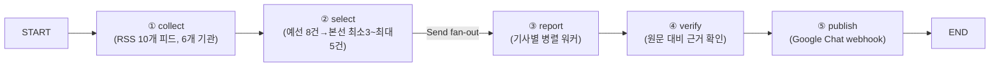

# 뉴스레터 에이전트 — 대입·교육정책 도메인 설계

- 날짜: 2026-09-15
- 대상 프로젝트: `my-newsletter` (Aiffel "6. 에이전트 팀 꾸리기" 실습 프로젝트)
- 기존 코드: `graph.py`(수집→선별→요약→검수→발행, LangGraph), `run.py`, `metrics_report.py`, `.github/workflows/daily.yml`
- 원칙: 구조(그래프·선별 로직·검수 로직)는 그대로 두고, 분야별 내용(독자·기준·소스·토픽)만 교체한다 — 강의 AT02-13 "운영 — 내 분야로 옮기기" 방식을 따름

## 1. 목표

기존 "AI 뉴스" 뉴스레터 에이전트를, **대입·교육정책 분야**의 입학사정관·진학상담교사를 위한 뉴스레터 에이전트로 전환한다. 5단계(수집·선별·요약·검수·발행) 파이프라인 구조는 재사용하고, 코드에 박혀 있던 AI 도메인 문자열만 교육 도메인 값으로 교체한다.

## 2. 독자 정의

- 누구: **입학사정관·진학상담교사** — 대학 입학처에서 전형을 설계·심사하는 사람, 고교에서 학생 진학을 지도하는 사람
- 이미 아는 것: 입시 용어(수시·정시·학생부종합전형 등), 대학별 기본 전형 구조
- 톤: 기존 코드와 동일하게 "~합니다"체, 기자체 과장 표현 금지
- 왜 중요한지(why) 문장 공통 지침: "상담 또는 입학사정 업무에 바로 참고할 수 있는 시사점"으로 통일 (기존 "국내 개발팀에게 왜 중요한지"를 대체)

## 3. 자료 수집 — 소스

### 3.1 채택 소스 (6개 기관·매체, 10개 RSS 피드, 연결 상태 직접 확인 완료)

| 소스 | URL | 확인 결과 |
|---|---|---|
| 베리타스알파 · 대입/대학/고입/고교/교육 섹션 (5개 피드) | `veritas-a.com/rss/S1N2~S1N6.xml` | HTTP 200 (전부). 전체기사(`allArticle.xml`)만 쓰다가, RSS가 최신 50건만 유지해 무관 기사에 밀려나는 문제를 발견하고, 사이트 실제 내비게이션의 섹션 코드(`sc_section_code`)를 확인해 관련 섹션만 개별 수집하는 방식으로 전환. 입학사정관은 지원자 출신 고교 특성도 파악해야 하므로 고입·고교 섹션도 포함. URL 기준 중복 제거로 겹치는 기사는 한 번만 집계됨 |
| 에듀동아 | `https://edu.donga.com/rss/allArticle.xml` | HTTP 200, `application/xml` |
| 에듀진 | `https://www.edujin.co.kr/rss/allArticle.xml` | HTTP 200, `application/xml`. 입시 전문지라 전체기사 자체가 학생부종합전형·논술·수시 콘텐츠 위주. 섹션별 피드는 같은 CMS 벤더(ND소프트)의 타사 데모 데이터 혼입/403 에러로 미사용 |
| 한국대학신문(UNN) | `https://news.unn.net/rss/allArticle.xml` | HTTP 200, `application/xml` |
| 한국교육개발원(KEDI) 보도자료 | `https://www.kedi.re.kr/khome/main/announce/rssAnnounceData.do?board_sq_no=3` | HTTP 200, `text/xml`. 내용 확인: "2026년 교육기본통계 조사 결과 발표", "N수생의 특성 분석: 입시 결과 및 대학 경험" 등 — 교육부 산하 국책연구기관의 정책·통계 보도자료로, 공식 발표에 가장 근접한 실제 작동 소스 |
| 서울특별시교육청 | `https://enews.sen.go.kr/rss.do` | HTTP 200, `application/rss+xml`. 전체기사 42,626건 누적, 표준 RSS 2.0. 16개 시도교육청 중 직접 확인·교차검증(유사 오픈소스 `j-k-park/edu-news`)으로 유일하게 공식 RSS가 있는 곳. 단, `pubDate`가 시각 없이 날짜만 제공돼(`2026-09-14`) `published_at()`에 KST 보정 로직을 추가함 — 날짜만 있을 때 그날 자정이 아니라 "그날이 끝나는 시각(23:59:59 KST)"으로 해석해야 24시간 컷오프 경계에서 부당하게 제외되지 않는다 |

모든 피드가 `feedparser`로 바로 파싱 가능한 표준 RSS 2.0이며, 기존 `collect()` 함수의 `SOURCES` 리스트 형식(`(이름, url)` 튜플)을 그대로 사용할 수 있다. 베리타스알파만 같은 이름으로 URL이 다른 다섯 항목(대입·대학·고입·고교·교육 섹션)을 등록했고, `collect()`가 기사 URL 기준으로 중복을 제거하므로 겹치는 기사가 두 번 집계되지 않는다.

### 3.2 검토 후 탈락한 소스 (REPORT.md 소스채택표용 근거)

| 후보 | 시도한 URL(예시) | 탈락 사유 |
|---|---|---|
| 교육부 보도자료 | `moe.go.kr/boardCnts/list.do?boardID=294...` 등 다수 패턴 | RSS 미제공. 목록 페이지가 정적 HTML이 아니라 JS로 데이터가 채워지는 구조(초기 응답에 기사 식별자 없음) — `requests`만으로 수집 불가 |
| 한국대학교육협의회(대교협) | 공식 사이트 전체 탐색 | RSS 링크 미발견 |
| korea.kr 정책브리핑 (부처별 RSS) | `korea.kr/rss/dept_A00002.xml` 등 다수 패턴 | 부처별 RSS는 체크박스로 커스텀 생성되는 방식으로 추정, 정적 URL 패턴 확인 실패 |
| KICE 학생평가지원포털 | `stas.moe.go.kr/cmn/page/pageContDtl:RSS` | 사이트에 "RSS" 안내 링크 자체는 존재하나, 실제 피드 URL 목록이 SPA에서 JS로 렌더링되어 정적 HTML에는 없음. API 엔드포인트 추측 시도(복수 패턴) 모두 404 — 브라우저로 네트워크 요청을 직접 관찰해야 정확한 엔드포인트 확인 가능 |
| 한국교육개발원(KEDI) 공지사항(`board_sq_no=1`) | 위와 동일 도메인, 다른 게시판 | RSS는 정상 작동하나 내용이 영상공모전·타 국책연구기관(에너지경제연구원 등) 원장 채용공고 등과 섞여 있어 관련성 낮음. 보도자료(`board_sq_no=3`)가 이미 실질적 내용을 커버해 중복 채택하지 않음 |
| 한국교육개발원(KEDI) 교육정책포럼 저널 | `rssMZJournalData.do` | HTTP 200이지만 RSS가 아닌 "Exception page" 에러 HTML 반환 — URL 파라미터 또는 세션 필요로 추정, 현재 접근 불가 |
| KOSIS 최근수록자료 | `kosis.kr/rss/themes_rss.jsp` | 정상 작동하나 전국 모든 통계 분야가 뒤섞인 전체 피드(예: "대전광역시유성구기본통계") — 교육 카테고리 전용 테마 ID 미확인, 노이즈가 너무 커서 제외 |
| 커리어넷 드림레터 | `career.go.kr/cnet/common/service/dreamLetter.rss` | HTTP 500, 홈페이지로 리다이렉트됨 — 현재 URL이 깨져 있음 |
| 서울 외 15개 시도교육청 (부산·대구·인천·대전·울산·세종·경기·강원·충북·충남·전북·경북·경남·전남·광주·제주) | 각 공식 사이트 | 서브도메인 패턴(`news.xxx.go.kr` 등) 추측 시도 전부 연결 실패(DNS/연결 자체 안 됨). 유사 오픈소스 프로젝트(`j-k-park/edu-news`)도 이 15곳은 `board: null`로 남기고 구글 뉴스 검색 RSS로 대체 중임을 교차 확인 — 공식 RSS 부재로 판단 |

→ **결론: 공식 발표(교육부·대교협·KICE) 소스는 이번 제출 범위에서 제외**하고, 전문 매체 4개(베리타스알파 5개 섹션 피드 포함) + KEDI 보도자료 1개(정책·통계 콘텐츠로 공식 발표에 가장 근접) + 서울특별시교육청 1개(16개 시도교육청 중 유일한 공식 RSS) 총 6개 기관·매체(10개 피드)로 MVP를 구성한다. MOE/KICE는 목록이 JS로 렌더링되는 구조라 `requests`만으로 수집이 불가능해 브라우저 기반 정찰이 필요하며, 이는 §11 스트레치 목표로 남긴다.

## 4. 자료 선별 — 기준

기존 `select()`의 예선(BATCH=40)/본선(TARGET) 2단계 구조, `Pick`/`Shortlist` 스키마는 그대로 재사용한다. `CRITERIA` 문자열만 교체한다. 다만 과제 요구사항("3~5건")과 달리 원래 코드는 본선 상한(TARGET=5)만 있고 하한이 없어서, 실제로 1~2건만 나오는 경우를 실행 중 발견했다 — `backfill_minimum()`을 추가해 `MIN_TARGET`(3) 미만이면 예선 통과작 중 남은 것으로 코드 레벨에서 채운다 (자세한 내용은 REPORT.md §3).

**중요도 기준** (예/아니오로 답할 수 있는 문장, 위에 있을수록 우선):
1. 신학년도 입시 일정·제도가 새로 발표되었는가 (수시·정시 일정, 전형 신설·폐지)
2. 특정 대학의 신학년도 모집요강이 새로 발표되었는가 (정원, 신설 학과·전형)
3. 교육부·KICE가 정책을 발표했는가 (고교학점제, 수능 개편 등)
4. 입시 지원·합격 관련 통계가 갱신되었는가 (지원율, 경쟁률, 충원율, 합격선 등 대입 결과 지표. 대출·취업 등 입시와 무관한 일반 통계는 제외 — 실제 실행 중 "학자금대출 연체" 기사가 이 기준으로 잘못 선별되어 좁힘)
5. 특정 대학의 정원·구조·재정지원 관련 소식이 발표되었는가 (통폐합, 정원 조정, 재정지원사업 선정, 취업률 등 운영 지표 공개 — "대학 소식" 토픽과 짝을 맞추기 위해 추가)
6. 특정 고교의 교육과정·프로그램·시설·성과 관련 소식이 있는가 (고교학점제 운영, 신설 프로그램·성과 — 입학사정관이 지원자 출신 고교 특성을 파악해야 한다는 이유로 추가, "고교 소식" 토픽과 짝을 맞춤)
7. 특정 고교 또는 고교 유형의 고입 관련 소식이 발표되었는가 (개별 학교·특목고·자사고·일반고 등의 입시요강, 지정 취소/유지, 전형 일정 변경 — 6번은 "이미 재학 중인 학교의 특성", 7번은 "그 학교에 들어가는 과정"으로 성격이 달라 분리. 대입의 ①입시제도/②모집요강 구조를 고입에도 적용)

1·2·5번은 처음에 "바뀌었는가"로 썼다가 "발표되었는가"로 재조정했다. 입시 일정·모집요강·재정지원사업 선정은 매년 정기적으로 새로 나오는 정보라서, "작년과 달라졌는가"를 묻는 "바뀌었는가"는 정기 발표 자체를 놓칠 위험이 있다. 3번(정책 발표)처럼 비정기적 이벤트나 통폐합처럼 진짜 "변화"인 것만 그 프레임을 유지했다.

**버릴 것** (구체적 표현으로 제한):
- 대학 홍보성 소식 (동문상, 축제, 업무협약, 기부금 유치)
- 미확정 예고성 발표 (검토 중, 추후 발표 예정이라고만 한 것)
- 특정 사교육 업체·컨설팅 상품 홍보

## 5. 요약 — 토픽 분류 (6개)

기존 `Draft.topic`(5개 Literal)을 아래 6개로 교체한다. `report()`의 프롬프트(`REPORT_SYS`)·구조는 그대로 재사용.

| 토픽 | 다루는 것 | 데스크지침 |
|---|---|---|
| 입시제도·정책 | 수시·정시 일정, 전형 신설/폐지, 교육부·KICE 발표 | 시행 시기·적용 학년/입학연도를 숫자로 명시 |
| 대학별 모집요강 | 특정 대학의 전형 변경, 신설 학과·전형 | 대학명·전형명·변경 전후 수치 포함 |
| 입시통계·데이터 | 경쟁률, 충원율, 합격선, 지원자 수 추이 | 전년 대비 증감치와 출처 명시 |
| 고교 소식 | 고교학점제·교육과정·프로그램·시설·성과 등 고교 관련 소식 전반 | 학교명과 구체적으로 무엇이 달라지는지 명시. 수치·사실 근거가 있는 것만 |
| 대입 트렌드·사례 | 특정 학교·지역 진학 사례, 새 전형 유형 사례 | 상담·입학사정 업무에 바로 쓸 시사점 한 문장 |
| 대학 소식 | 대학 통폐합·정원 조정·재정지원사업 선정, 취업률·장학금 등 정량 지표 | 수치·정책 근거가 있는 것만. 순수 홍보(동문상·축제·협약)는 §4 "버릴 것"으로 제외 |

`COLORS` 딕셔너리(토픽별 색상)는 Google Chat 발행 방식(§7)에서는 사용하지 않으므로 삭제하거나 이모지 매핑으로 대체한다.

## 6. 검수

기존 `verify()`/`check()`의 할루시네이션 검증 로직(원문 대비 근거 확인)은 도메인 불문 구조이므로 **변경 없이 그대로 재사용**한다.

## 7. 발행 — Google Chat

기존 `publish()`/`send()`/`build_embeds()` (Discord 웹훅 + embed) 를 Google Chat 웹훅으로 교체한다.

- 방식: Incoming Webhook URL에 `POST`, `Content-Type: application/json`, 바디는 단순 텍스트 (`{"text": "..."}`) — Discord의 embed(제목·색상·필드 배열)에 대응하는 리치 카드(Cards v2)는 이번 범위에서 사용하지 않는다. 이유: 리치 카드 스키마는 Discord embed와 호환되지 않아 별도 매핑이 필요하고, 단순 텍스트로도 다섯 개 기사(헤드라인·요약·이유·링크)를 충분히 전달할 수 있다 (YAGNI).
- 텍스트 포맷: Google Chat은 `*굵게*`, `_기울임_`, `<url|텍스트>` 링크 문법을 지원 (Slack mrkdwn과 유사하지만 별도 문법) — 기사별로 `*{i}. {토픽이모지} {headline}*\n{summary}\n💡 {why}\n<{url}|원문 보기> · {topic} · {source} · {when}` 형태로 조립. 토픽별 이모지(📋🎓📊🏫📈🏛️)는 `audience.yaml`의 `토픽[].이모지`에서 가져오며, Discord의 embed color(사이드바 색상 줄)에 대응하는 시각적 구분을 텍스트 메시지 안에서 이모지로 대체한 것 — Google Chat 텍스트 메시지는 색상 자체를 지원하지 않음을 확인함
- 환경변수: `DISCORD_WEBHOOK_URL` → `GCHAT_WEBHOOK_URL`로 이름 변경. `DRY_RUN` 기본값(1=발행 안 함) 로직은 그대로 유지
- `.github/workflows/daily.yml`의 secrets 참조도 `GCHAT_WEBHOOK_URL`로 변경

## 8. 설정/코드 분리 — `audience.yaml`

강의가 권장한 방식(③ 설정 파일 분리)을 따른다. `CRITERIA` 문자열을 만들던 자리에 YAML 로딩 코드를 넣는다 (기존 코드는 한 줄도 안 바뀜, `build_criteria(cfg)` 결과가 같은 상수 이름에 들어가는 방식).

```yaml
독자:
  누구: "입학사정관·진학상담교사 — 대학 입학처 전형 담당자, 고교 진학 지도 교사"
  이미_아는_것: "수시·정시 구분, 학생부종합전형 등 기본 입시 용어"

중요도_기준:
  - "신학년도 입시 일정·제도가 새로 발표되었는가 (수시·정시 일정, 전형 신설·폐지)"
  - "특정 대학의 신학년도 모집요강이 새로 발표되었는가 (정원, 신설 학과·전형)"
  - "교육부·KICE가 정책을 발표했는가 (고교학점제, 수능 개편 등)"
  - "입시 지원·합격 관련 통계가 갱신되었는가 (지원율, 경쟁률, 충원율, 합격선 등 대입 결과 지표. 대출·취업 등 입시와 무관한 일반 통계는 제외)"
  - "특정 대학의 정원·구조·재정지원 관련 소식이 발표되었는가 (통폐합, 정원 조정, 재정지원사업 선정, 취업률 등 운영 지표 공개)"
  - "특정 고교의 교육과정·프로그램·시설·성과 관련 소식이 있는가 (고교학점제 운영, 신설 프로그램·성과)"
  - "특정 고교 또는 고교 유형의 고입 관련 소식이 발표되었는가 (개별 학교·특목고·자사고·일반고 등의 입시요강, 지정 취소/유지, 전형 일정 변경)"

버릴_것:
  - "대학 홍보성 소식 (동문상, 축제, 업무협약, 기부금 유치)"
  - "미확정 예고성 발표 (검토 중, 추후 발표 예정이라고만 한 것)"
  - "특정 사교육 업체·컨설팅 상품 홍보"

토픽:
  - 이름: "입시제도·정책"
    데스크지침: "시행 시기와 적용 학년/입학연도를 반드시 숫자로 명시"
    이모지: "📋"
  - 이름: "대학별 모집요강"
    데스크지침: "대학명·전형명과 변경 전후 수치를 반드시 포함"
    이모지: "🎓"
  - 이름: "입시통계·데이터"
    데스크지침: "전년 대비 증감치와 출처를 반드시 명시"
    이모지: "📊"
  - 이름: "고교 소식"
    데스크지침: "학교명과 구체적으로 무엇이 달라지는지(교육과정·프로그램·시설·성과·학점제 등)를 명시. 수치·사실 근거가 있는 것만"
    이모지: "🏫"
  - 이름: "대입 트렌드·사례"
    데스크지침: "상담·입학사정 업무에 바로 쓸 시사점을 한 문장으로"
    이모지: "📈"
  - 이름: "대학 소식"
    데스크지침: "수치·정책 근거가 있는 것만. 순수 홍보성은 제외"
    이모지: "🏛️"
```

`requirements.txt`에 `pyyaml` 한 줄을 추가한다. 파일이 없을 때 즉시 멈추는 방식(강의 권장)을 따른다 — 기본값으로 조용히 도는 대신 `FileNotFoundError`로 실행을 막는다.

## 9. 파이프라인 구조 (변경 없음)



State(`Brief` TypedDict), 노드 5개, 엣지 구조 모두 기존과 동일. `select`의 `fan_report`(Send를 통한 팬아웃)도 그대로.

## 10. 비목표 (Non-goals)

- 교육부/KICE 공식 발표 스크래핑 (§3.2, §11에서 스트레치 목표로 분리)
- Slack, 텔레그램, 이메일 등 다른 채널 동시 지원 (Google Chat 1채널만 이번 범위)
- `audience.yaml`의 pydantic 스키마 검증 (강의의 "더 해보기" 항목, 스트레치 목표)
- 실제 발행 자동 실행 (설계·구현 단계에서는 `DRY_RUN=1` 유지, 실제 발행은 사용자가 별도로 검증 후 결정 — 이후 구현이 끝난 뒤 사용자 승인을 받아 수동으로 여러 차례 실제 발행해 정상 동작을 확인함. "자동" 실행(cron)을 막는다는 의미였지, 수동 실제 발행 자체를 막는 것은 아니었음)

## 11. 스트레치 목표 (향후 과제)

- 교육부/KICE 공식 발표를 별도 수집 노드(`collect_official`)로 추가 — 두 사이트 모두 목록이 SPA에서 JS로 채워지므로, 브라우저(Playwright 등)로 실제 API 엔드포인트를 정찰한 뒤 그 결과(JSON API URL 또는 렌더링 후 선택자)만 가벼운 `requests` 코드로 옮겨 심는다. 특히 KICE 학생평가지원포털은 "RSS" 안내 링크가 이미 존재하므로 우선순위가 높음
- `audience.yaml`을 pydantic `Audience` 모델로 검증해 오타를 시작 시점에 잡기

## 12. 완료 기준 (Acceptance Criteria)

- AC1: `graph.py`의 `SOURCES`가 §3.1의 10개 RSS 피드(6개 기관·매체)로 교체되고, 실제 실행 시 정상 수집되며 중복 기사가 두 번 집계되지 않음
- AC2: `audience.yaml`이 존재하고 `CRITERIA`/`SYS`가 이 파일에서 조립됨 (코드에 하드코딩된 도메인 문자열 없음)
- AC3: `Draft.topic`이 §5의 6개 값으로 교체됨
- AC4: `publish()`가 Google Chat 웹훅으로 전송하며, `DRY_RUN=1`일 때 콘솔에 메시지 미리보기가 출력됨
- AC5: `run.py --dry-run` 실행 시 에러 없이 끝까지 완주하고 `store/metrics.jsonl`에 기록이 남음
